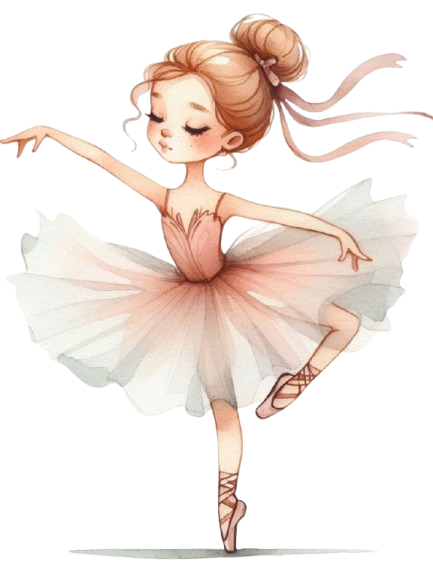
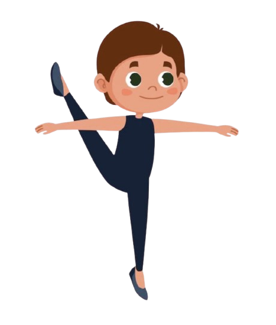

    
    

  <h3 align="center">🩰 BotBallerina - Assistente Virtual para Aulas de Ballet Online</h3>
Este projeto visa criar um bot de assistente virtual para uma professora de ballet, focado em oferecer suporte durante as aulas online. O bot será capaz de interagir com os alunos, fornecer dicas de técnica, corrigir posturas e até gerar planos de treinamento baseados no nível de cada aluno.
O projeto será desenvolvido com boas práticas de prompt engineering, utilizando IA para uma experiência de aprendizado mais interativa e personalizada.

## 📋 Índice

- [📋 Índice](#-índice)
- [📝 Introdução](#-introdução)
- [💃 Níveis de Ballet](#-níveis-de-ballet)
- [📅 Frequência de Aulas](#-frequência-de-aulas)
- [🏋️ Tipos de Exercícios](#️-tipos-de-exercícios)
- [🛠️ Regras de negócio](#️-regras-de-negócio)
- [📖 Material de Apoio](#-material-de-apoio)
- [🎯 Prompt de Resposta Proposto](#-prompt-de-resposta-proposto)

---

## 📝 Introdução

Este projeto busca criar um assistente virtual personalizado para uma professora de ballet, com o objetivo de ajudar a gerenciar aulas online, oferecer feedbacks sobre o desempenho dos alunos, além de recomendar exercícios específicos para o nível de cada um. O bot terá um sistema inteligente de respostas que simula uma interação com um instrutor experiente.

---

## 💃 Níveis de Ballet

A primeira personalização do bot é o nível de habilidade do aluno. Existem diferentes níveis de aprendizagem no ballet, que serão usados para adaptar o conteúdo das aulas:

<table>
  <tr>
    <th>Imagem</th>
    <th>Nível</th>
    <th>Descrição</th>
  </tr>
  <tr>
    <td style="text-align: center;">
      
    </td>
    <td><strong>Novato</strong></td>
    <td>Alunos que estão iniciando o ballet. Foco em movimentos básicos e postura.</td>
  </tr>
  <tr>
    <td style="text-align: center;">
      
    </td>
    <td><strong>Intermediário</strong></td>
    <td>Alunos com alguma experiência, já dominam o básico e estão prontos para progressões mais complexas.</td>
  </tr>
  <tr>
    <td style="text-align: center;">
      
    </td>
    <td><strong>Avançado</strong></td>
    <td>Alunos experientes, que realizam movimentos e combinações mais difíceis, com foco na fluidez e técnica apurada.</td>
  </tr>
</table>

> **Nota:** Escolha o nível que melhor descreve o aluno para que o bot forneça dicas e correções mais eficazes.

---

## 📅 Frequência de Aulas

O segundo fator que o bot levará em consideração é a frequência de aulas do aluno. Isso ajudará o bot a adaptar as sugestões de treino e progressão de acordo com o tempo disponível para praticar:

| **Imagem**                                                     | **Frequência de Aulas** | **Plano de Aulas Sugerido** |
| ---------------------------------------------------------------- | ---------------------- | --------------------------- |
|  | 1 vez por semana        | Aulas leves, focadas em postura e flexibilidade. |
|  | 2-3 vezes por semana    | Aulas de técnica combinada com alongamento e força. |
|  | 4-5 vezes por semana    | Treinos intensivos com foco em técnicas avançadas e performance. |

- **Leve**: Aulas focadas em flexibilidade, posturas e movimentos básicos.
- **Intermediário**: Aulas que combinam técnica, força e fluidez.
- **Avançado**: Aulas intensivas com combinação de exercícios complexos e preparação para apresentações.

---

## 🏋️ Tipos de Exercícios

A terceira consideração é sobre os tipos de exercícios preferidos ou necessários para cada nível de aluno. O bot adaptará os treinos de acordo com as preferências e os objetivos de cada um:

| **Imagem**                                                       | **Tipo de Exercício** | **Descrição**                                                                                                   |
| ---------------------------------------------------------------- | --------------------- | --------------------------------------------------------------------------------------------------------------- |
|     | **Barra**             | Exercícios realizados na barra, focados em técnica e postura, como pliés e tendus.                              |
|      | **Solo**              | Exercícios de solo para melhorar a força, flexibilidade e a coordenação dos movimentos.                         |
|     | **Saltos**            | Exercícios focados no aumento de salto e na correção de postura durante o movimento.                             |
|  | **Alongamento**      | Exercícios de alongamento para melhorar a flexibilidade e prevenir lesões.                                       |
|    | **Cardio**            | Exercícios cardiovasculares, como dança aeróbica, que ajudam a melhorar a resistência e a forma física geral.    |

---

## 🛠️ Regras de negócio

1. **Identifique o nível do aluno** consultando a seção de níveis de ballet.
2. **Determine a frequência de aulas disponíveis** e selecione o plano de treino correspondente.
3. **Escolha os tipos de exercícios preferidos** e o bot adaptará o treino de acordo com o nível de habilidade e disponibilidade do aluno.
4. Use o prompt para gerar um plano de treino personalizado para cada aluno.

---

## 📖 Material de Apoio

Aqui estão alguns recursos adicionais que podem ser úteis para entender melhor o projeto e as práticas de prompt engineering:

- [Fundamentos de Engenharia de Prompt](https://elidianaandrade.gitbook.io/fundamentos-de-engenharia-de-prompts-com-claude-3)
- [Boas práticas de prompt](https://aline-antunes.gitbook.io/otimize-seus-prompts-e-aprenda-mais-usando-ias-1)

---

## 🎯 Prompt de Resposta Proposto

O bot irá gerar um prompt baseado nas informações fornecidas pelo aluno, incluindo o nível de habilidade, a frequência de aulas e os tipos de exercício preferidos. Com isso, o plano de treino será idealmente ajustado para cada usuário.
